# 软件工程Lab6实验报告

洪睿琦 201502002


## 静态分析报告

### 静态分析工具的选取及安装

由于我的Lab4与Lab5均使用Python语言进行编程，因此选择Pylint作为静态分析工具。

如下为Pylint的安装截图：

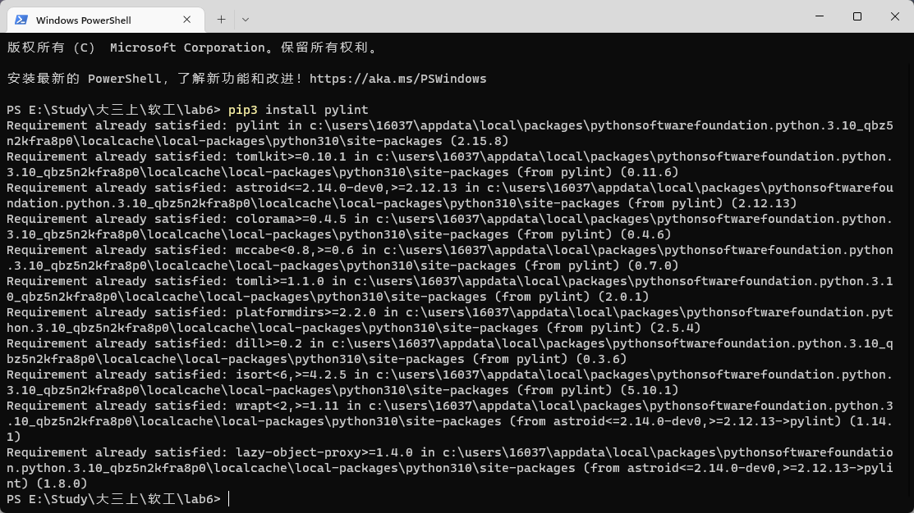


### 静态分析工具使用说明和结果分析

使用pylint Lab4，Lab5的每一个模块进行分析：

分析Lab4的sample_generator模块：

该模块负责读入stdin_format.txt，并根据用户设置的参数生成若干随机样例，以字符串列表的形式返回。

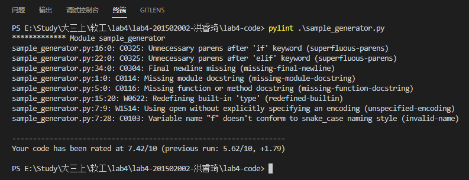

结果分析：

1. 源代码中存在一些多余的括号和缩进问题

2. 最后一行没有留空行

3. 模块开头和函数开头缺乏文档字符串

4. 一些变量命名不规范或者与python中内置定义符号命名类似

5. open使用没有encoding

   

分析Lab4的execute模块：

该模块负责读入由sample_generator模块生成的样例列表，和一个目录路径，对指定目录下的每一个cpp文件，调用编译器进行编译，并且执行传入样例列表每一个样例。最后将目录下每一个文件对于每一个样例的运行结果进行打包并且以json字符串的格式返回。

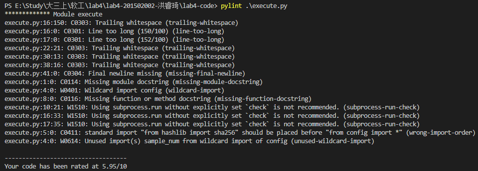

结果分析：

1. 多余的空格
2. 存在过长的行
3. 最后一行没有留空行
4. 使用了通配符import，且存在因为通配符引用而没有被使用的变量“sample_num”
5. 没有文档字符串
6. 使用suprocess.run时没有显式的定义check参数
7. 错误的引入顺序


分析Lab4的main模块：

main模块是机器比对模块的主要模块，其负责遍历input文件夹下的每一个子目录并且调用上述两个模块并且负责输出最后的equal.csv和inequal.csv。

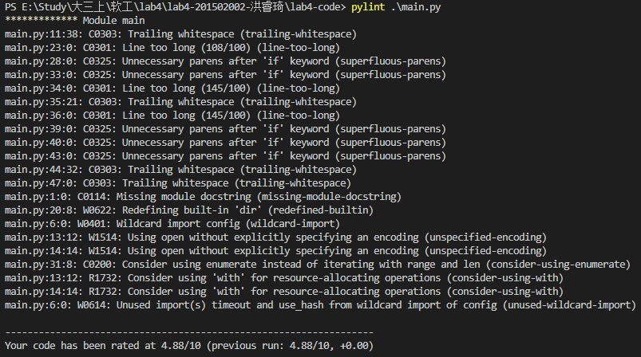

结果分析

1. 多余的空格
2. 存在过长的行
3. 源代码中存在一些多余的括号和缩进问题
4. 没有文档字符串
5. 一些变量命名不规范或者与python中内置定义符号命名类似
6. open使用没有encoding
7. 使用了通配符import，且存在因为通配符引用而没有被使用的变量“timeout”,"use_hash"
8. open语句没有伴随with使用
9. for循环时考虑使用enumerate函数


分析Lab5的源代码：

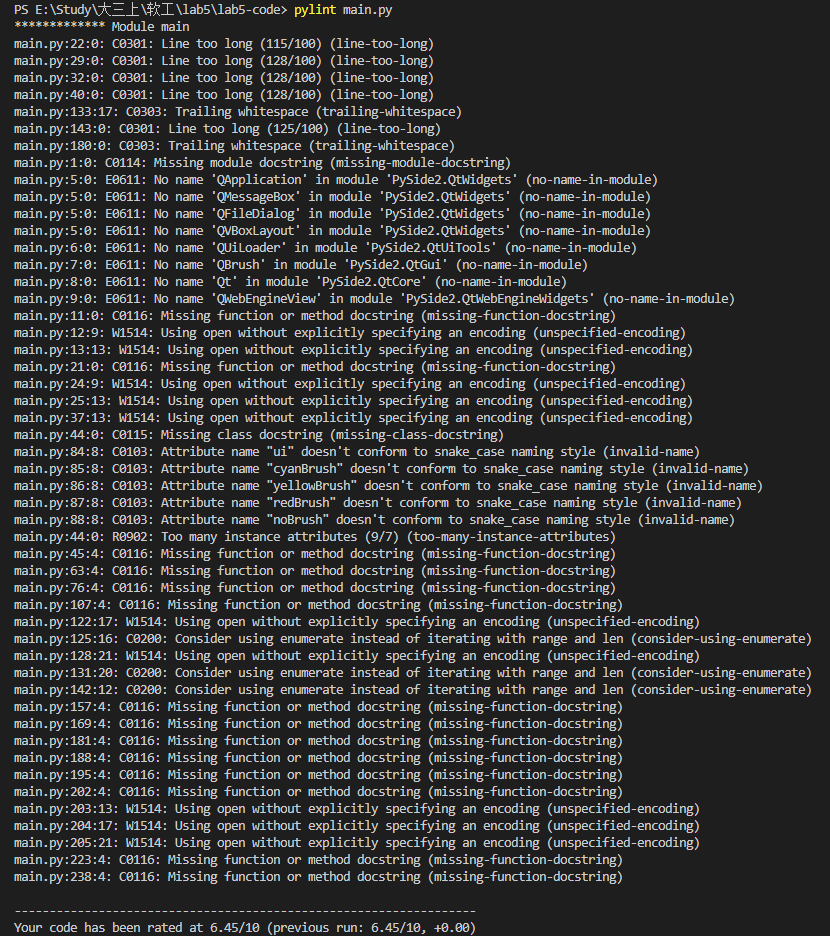

结果分析：

1. 存在过长的行
2. 多余的空格
3. 命名不规范
4. 缺乏文档字符串
5. open使用没有encoding
6. for循环时考虑使用enumerate函数


### 部分代码修复

下面展示了根据pylint的提示，部分代码修复的code diff。

#### 1.sample_generator模块的修复

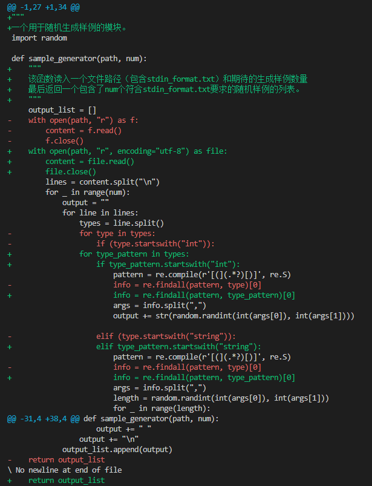

#### 2.execute模块的修复

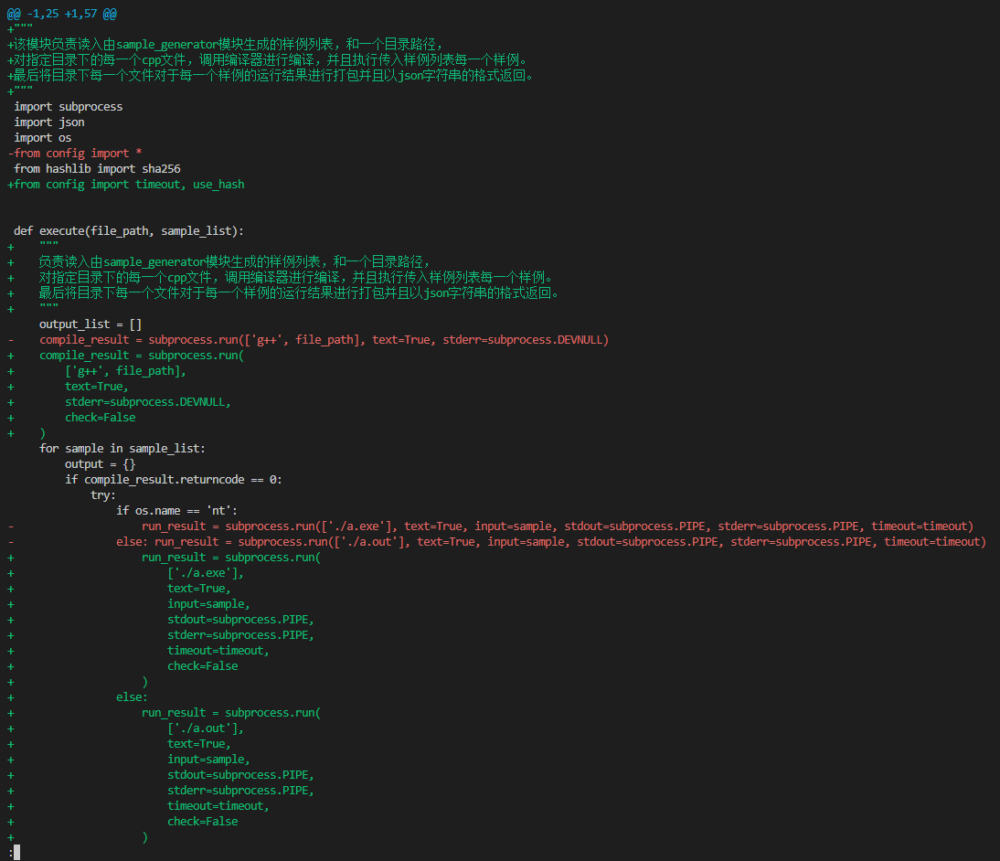

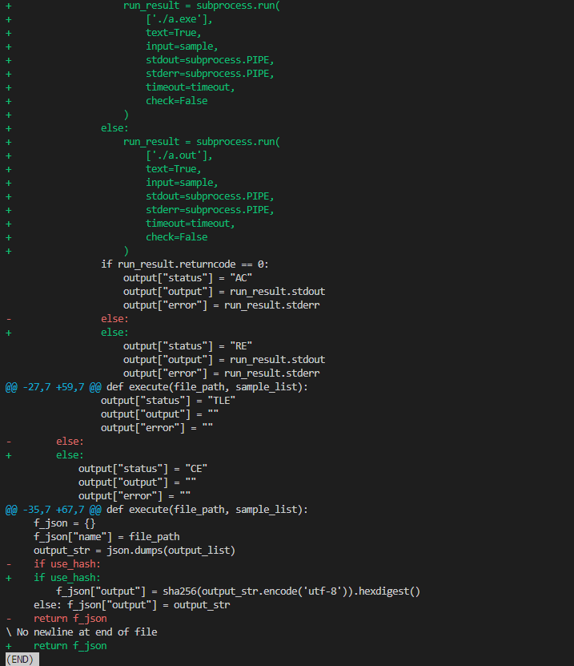

修复后，这两个模块的Pylint评分均为10。


## 单元测试报告

### 测试目的

验证Lab4中的sample_generator模块和execute模块行为的正确性，并且尽量得到高的测试覆盖率


### 测试对象

Lab4中的sample_generator模块和execute模块


### 测试环境

Windows 11 & Ubuntu 22.04


### 测试工具

Python的unittest模块


### 测试过程

#### 对sample_generator模块的单元测试

**测试目的：**主要用于测试该模块能否正确读入对应的format文件并且正确地解析每个变量的类型、范围等信息。

下面是该模块单元测试的代码：

```python	
import string
import unittest
from sample_generator import sample_generator

class TestSample(unittest.TestCase):
    def test_int(self):
        sample_num = 100
        result_list = sample_generator("test_sample_generator/test_int.txt", sample_num)
        # test_int.txt的内容是：int(1,300) int(400,500)
        self.assertEqual(len(result_list), sample_num)
        for result in result_list:
            data = result.split(" ")
            self.assertEqual(len(data), 3)
            self.assertEqual(data[-1], "\n")
            try:
                int_data1 = int(data[0])
                int_data2 = int(data[1])
            except:
                self.assertTrue(False)
            self.assertTrue(1 <= int_data1 and int_data1 <= 300 and 400 <= int_data2 and int_data2 <= 500)
            
    def test_string(self):
        sample_num = 100
        result_list = sample_generator("test_sample_generator/test_string.txt", sample_num)
        #test_string.txt的内容是：string(3,20) string(21,40)
        self.assertEqual(len(result_list), sample_num)
        for result in result_list:
            data = result.strip("\n")
            data = result.split(" ")
            self.assertEqual(len(data), 3)
            self.assertEqual(data[-1], "\n")
            str1, str2, _ = data
            for ch in str1:
                self.assertIn(ch, string.ascii_letters)
            for ch in str2:
                self.assertIn(ch, string.ascii_letters)
            self.assertTrue(3 <= len(str1) and len(str1) <= 20 and 21 <= len(str2) and len(str2) <= 40)

  
if __name__ == '__main__':
    unittest.main()
```

从上面的代码可以看出，共准备了两个测试用例，分别是对于读入整数和字符串的输入。

因为sample_generator支持用户自己选择生成样例的数量，两个测试用例都首先对输出结果中的样例数量进行检查。

在对数量检查后，对每个样例分别检查了生成的符号数量是否与format文件符合以及每个符号的类型、范围、长度等信息进行了检查。

如下为上述代码的测试结果：

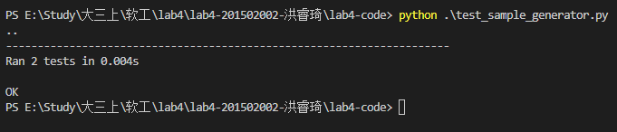

我们以语句覆盖率这一白盒覆盖率作为测试覆盖率，不难验证上述测试对于sample_generator.py源码的覆盖率为100%。（源码中的主要分支为string和int类型，分别被两个样例覆盖）


#### 对execute模块的单元测试

**测试目的：**主要用于测试该模块能否正确地在不同的操作系统下调用编译器（g++）编译待执行程序并且对于各种不同的运行结果，将结果聚合成符合要求的json格式。

下面是该模块单元测试的代码：

```python
import unittest
import os 
from execute import execute
import json
from config import use_hash

pwd = os.getcwd()

class TestExecute(unittest.TestCase):
    def test_add(self):
        self.assertFalse(use_hash, "Please make sure you have disabled use_hash")
        path = os.path.join(pwd, "test_execute")
        os.chdir(path)
        sample_list = [
            "13 25",
            "26 70",
            "100 129",
            "0 20",
        ]
        result = execute("add.cpp", sample_list)
        expect_output = [
            {
                "status": "AC",
                "output": "38\n",
                "error": ""
            },
            {
                "status": "AC",
                "output": "96\n",
                "error": ""
            },
            {
                "status": "AC",
                "output": "229\n",
                "error": ""
            },
            {
                "status": "AC",
                "output": "20\n",
                "error": ""
            }
        ]
        expect = {
            "name": "add.cpp",
            "output": json.dumps(expect_output)
        }
        self.assertEqual(result, expect)

    def test_string_con(self):
        self.assertFalse(use_hash, "Please make sure you have disabled use_hash")
        path = os.path.join(pwd, "test_execute")
        os.chdir(path)
        sample_list = [
            "aljkdfal adfafd",
            "12 70",
            "kkk kk",
            "0 20",
        ]
        result = execute("string_con.cpp", sample_list)
        expect_output = [
            {
                "status": "AC",
                "output": "aljkdfaladfafd\n",
                "error": ""
            },
            {
                "status": "AC",
                "output": "1270\n",
                "error": ""
            },
            {
                "status": "AC",
                "output": "kkkkk\n",
                "error": ""
            },
            {
                "status": "AC",
                "output": "020\n",
                "error": ""
            }
        ]
        expect = {
            "name": "string_con.cpp",
            "output": json.dumps(expect_output)
        }
        self.assertEqual(result, expect)

    def test_compile_error(self):
        self.assertFalse(use_hash, "Please make sure you have disabled use_hash")
        path = os.path.join(pwd, "test_execute")
        os.chdir(path)
        sample_list = [
            "13 25",
            "26 70",
            "100 129",
            "0 20",
        ]
        result = execute("compile_error.cpp", sample_list)
        expect_output = [
            {
                "status": "CE",
                "output": "",
                "error": ""
            },
            {
                "status": "CE",
                "output": "",
                "error": ""
            },
            {
                "status": "CE",
                "output": "",
                "error": ""
            },
            {
                "status": "CE",
                "output": "",
                "error": ""
            },
        ]
        expect = {
            "name": "compile_error.cpp",
            "output": json.dumps(expect_output)
        }
        self.assertEqual(result, expect)

    def test_TLE(self):
        self.assertFalse(use_hash, "Please make sure you have disabled use_hash")
        path = os.path.join(pwd, "test_execute")
        os.chdir(path)
        sample_list = [
            "13 25",
            "26 70",
            "100 129",
            "0 20",
        ]
        result = execute("TLE.cpp", sample_list)
        expect_output = [
            {
                "status": "TLE",
                "output": "",
                "error": ""
            },
            {
                "status": "TLE",
                "output": "",
                "error": ""
            },
            {
                "status": "TLE",
                "output": "",
                "error": ""
            },
            {
                "status": "TLE",
                "output": "",
                "error": ""
            },
        ]
        expect = {
            "name": "TLE.cpp",
            "output": json.dumps(expect_output)
        }
        self.assertEqual(result, expect)

    def test_quick_sort(self):
        self.assertFalse(use_hash, "Please make sure you have disabled use_hash")
        path = os.path.join(pwd, "test_execute")
        os.chdir(path)
        sample_list = [
            "4\n7 4 5 3",
            "10\n10 9 8 7 6 5 4 3 2 1",
            "3\n2 4 5",
            "1\n1",
        ]
        result = execute("quick_sort.cpp", sample_list)
        expect_output = [
            {
                "status": "AC",
                "output": "3 4 5 7 ",
                "error": ""
            },
            {
                "status": "AC",
                "output": "1 2 3 4 5 6 7 8 9 10 ",
                "error": ""
            },
            {
                "status": "AC",
                "output": "2 4 5 ",
                "error": ""
            },
            {
                "status": "AC",
                "output": "1 ",
                "error": ""
            }
        ]
        expect = {
            "name": "quick_sort.cpp",
            "output": json.dumps(expect_output)
        }
        self.assertEqual(result, expect)

    def test_RE(self):
        self.assertFalse(use_hash, "Please make sure you have disabled use_hash")
        path = os.path.join(pwd, "test_execute")
        os.chdir(path)
        sample_list = [
            "13 25",
            "26 70",
            "100 129",
            "0 20",
        ]
        result = execute("RE.cpp", sample_list)
        expect_output = [
            {
                "status": "RE",
                "output": "",
                "error": ""
            },
            {
                "status": "RE",
                "output": "",
                "error": ""
            },
            {
                "status": "RE",
                "output": "",
                "error": ""
            },
            {
                "status": "RE",
                "output": "",
                "error": ""
            }
        ]
        expect = {
            "name": "RE.cpp",
            "output": json.dumps(expect_output)
        }
        self.assertEqual(result, expect)

if __name__ == '__main__':
    unittest.main()
```

如代码所示，共准备了6个测试样例，每个测试样例中，我们调用了execute函数执行了对应的c++程序，运行指定的4个测试数据并将结果与应有的结果进行比对。6个测试样例分别覆盖了程序正常运行、运行时错误、超时、编译错误的情况，比较全面地测试了execute函数的正确性。除此之外，因为在不同操作系统下，execute模块具有不同的行为，因此我在Windows和Ubuntu环境下分别运行了上述测试程序，以达到100%的语句覆盖率：

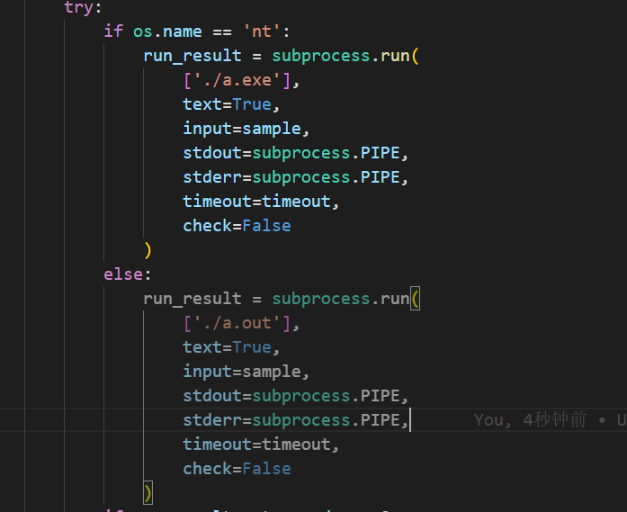

（如上图，execute.py在不同操作系统的行为有略微的差别）

以下为单元测试的测试结果：

在Windows环境下：

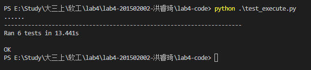

在Linux（Ubuntu）环境下：


结合execute.py源代码分析，因为不同的系统环境和不同的运行结果均被覆盖，单元测试的语句覆盖率为100%。

## 集成测试报告

下面，在我们已经对各模块进行了单元测试的前提下，我们将对Lab4中的等价判断工具进行集成测试


### 测试目的

验证Lab4中的sample_generator模块和execute模块的交互，在保证前者正确的基础上，对整个工具的功能正确性进行集成测试


### 测试对象

Lab4中的sample_generator模块和execute模块，以及包括main模块在内的工具整体


### 测试环境

Windows 11 & Ubuntu 22.04


### 测试工具

Python的unittest模块


### 测试过程

#### 集成测试1：sample_generator模块和execute模块的交互

**测试目的：**在等价确认工具中，execute模块会调用以sample_generator模块输出的包含多个根据一定格式生的的随机样例的列表作为输入，编译指定程序并使其在这些样例上运行，最后得出该指定程序在这些样例上的运行结果。本测试主要上述两模块交互过程的正确性。

该测试共有两个样例，分别测试了两个数字的整数加法和两个字符串的拼接，测试目录结构如下：

```
LAB6-CODE\INTERGRATION_TEST1
├─case1
│      add.cpp
│      stdin_format.txt
│      
└─case2
        stdin_format.txt
        string_con.cpp
```

以下为该项测试的测试代码：

```python
import os
import unittest
import json
from sample_generator import sample_generator
from execute import execute
from config import use_hash

pwd = os.getcwd()

class TestSample(unittest.TestCase):
    def test_int_add(self):
        sample_num = 10
        self.assertFalse(use_hash, "Please make sure you have disabled use_hash")
        path = os.path.join(pwd, "intergration_test1/case1")
        os.chdir(path)
        sample_list = sample_generator("stdin_format.txt", sample_num)
        expect_output = []
        for sample in sample_list:
            data = sample.split(" ")
            output = int(data[0]) + int(data[1])
            output = str(output)
            expect_output.append({
                "status": "AC",
                "output": output + "\n",
                "error": ""
            })
        expect = {
            "name": "add.cpp",
            "output": json.dumps(expect_output)
        }
        result = execute("add.cpp", sample_list)
        self.assertEqual(result, expect)
            
    def test_string_con(self):
        sample_num = 10
        self.assertFalse(use_hash, "Please make sure you have disabled use_hash")
        path = os.path.join(pwd, "intergration_test1/case2")
        os.chdir(path)
        sample_list = sample_generator("stdin_format.txt", sample_num)
        expect_output = []
        for sample in sample_list:
            data = sample.split(" ")
            output = data[0] + data[1]
            expect_output.append({
                "status": "AC",
                "output": output + "\n",
                "error": ""
            })
        expect = {
            "name": "string_con.cpp",
            "output": json.dumps(expect_output)
        }
        result = execute("string_con.cpp", sample_list)
        self.assertEqual(result, expect)
  
if __name__ == '__main__':
    unittest.main()
```

上述代码的基本逻辑即为先使用sample_generator生成若干组随机样例，然后调用execute得到运行结果，并将运行结果与python中直接计算sample应有的运行结果进行比对，来确保两模块交互过程中没有出现问题。

以下是在不同系统下的测试结果：


### 集成测试2：总体测试

**测试目的：**经过了上述测试，是时候进行全部模块的总体测试了！该测试目的是确保等价确认模块能够正确地读入输入、调用两个子模块进行结果计算，并且能够正确地将结果输出到对应csv文件中。

如下为该测试的测试目录树：

```
LAB6-CODE\INTERGRATION_TEST2
└─input
    ├─case1
    │      add1.cpp
    │      add2.cpp
    │      add3.cpp
    │      add4.cpp
    │      stdin_format.txt
    │      
    └─case2
            stdin_format.txt
            string_con1.cpp
            string_con2.cpp
            string_con3.cpp
```

在case1中，add1、add2、add3应当是等价的，而add4.cpp与前三者不等价。

在case2中，string_con1、string_con2等价，而string_con3与前两者不等价。


以下为该项测试的测试代码：
